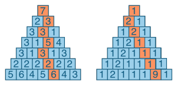

## Задание 9
Треугольник состоит из чисел следующим образом. Одно число находится на вершине. Ниже размещено два числа, затем три, и так далее до основания. Начинаете обход с вершины и до основания треугольника. За каждый ход можно спуститься на один уровень и выбрать между двумя числами под текущей позицией. По ходу движения основная задача «собирать» и суммировать числа, которые были выбраны. Необходимо найти максимальную сумму, которую можно получить из различных маршрутов. Реализовать модель такого треугольника и методы для симуляции прохождения по нему. Для удобства можно реализовать методы отображения треугольника с выбранным маршрутом на экран. Реализовать объявление треугольника в файле. Реализовать бота для прохождения треугольника по оптимальному маршруту, при этом маршрут необходимо отобразить на экран.
 
#### Примеры:

